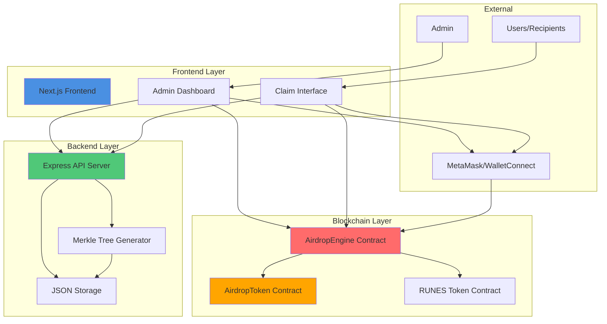
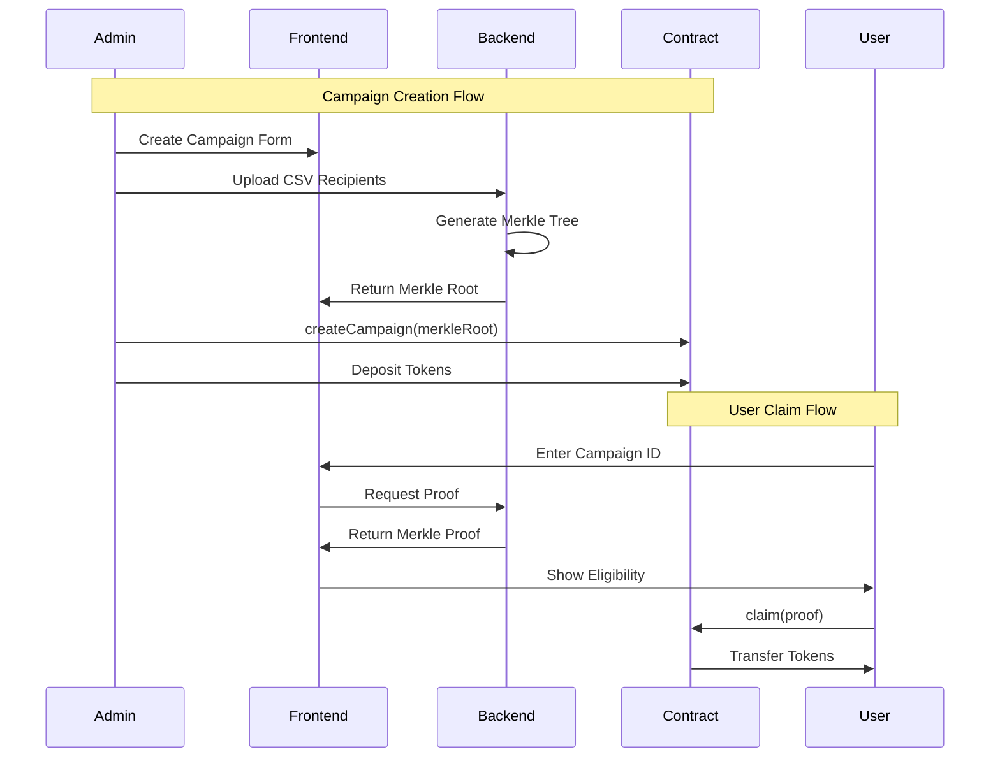
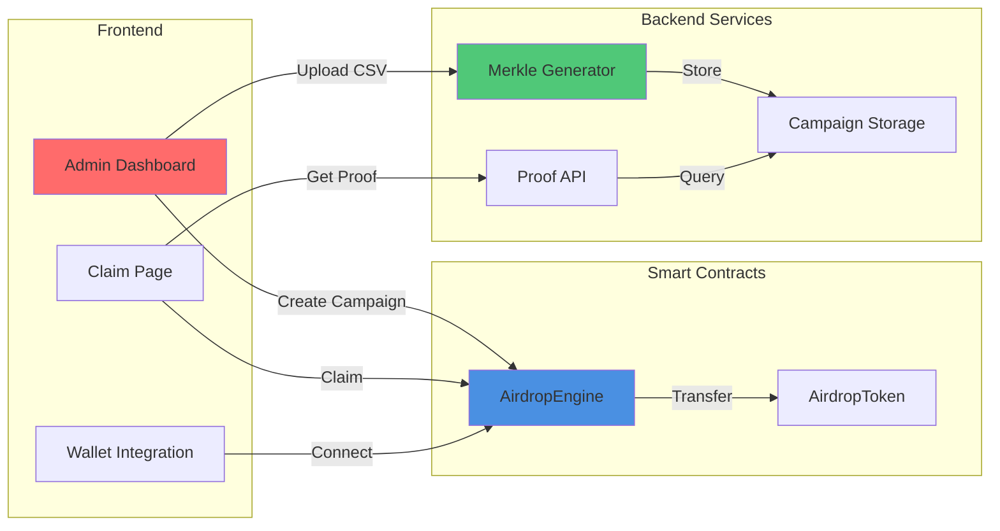

# Rootstock ERC-1155 Airdrop System

A complete, production-ready airdrop system for Rootstock that supports ERC-1155 tokens and bridged RUNES tokens with Merkle proof verification, batch distribution, and a beautiful web interface.

## 📋 Table of Contents

- [Overview](#overview)
- [System Architecture](#system-architecture)
- [Features](#features)
- [Quick Start](#quick-start)
- [Project Structure](#project-structure)
- [Installation](#installation)
- [Configuration](#configuration)
- [Usage Guide](#usage-guide)
- [Testing](#testing)
- [Deployment](#deployment)
- [Security](#security)
- [Contributing](#contributing)

## 🎯 Overview

This project implements a complete airdrop solution for Rootstock blockchain, enabling efficient distribution of ERC-1155 tokens and bridged RUNES tokens to eligible recipients. The system uses Merkle proofs for gas-efficient eligibility verification, allowing for scalable airdrops without storing recipient lists on-chain.

### Key Highlights

- ✅ **Full-Stack Solution**: Smart contracts, backend API, and frontend UI
- ✅ **Gas Efficient**: Merkle proof verification minimizes on-chain costs
- ✅ **Multi-Token Support**: ERC-1155 and bridged RUNES tokens
- ✅ **Production Ready**: Comprehensive testing, security features, and documentation
- ✅ **Beautiful UI**: Rootstock-inspired design with responsive layout
- ✅ **Easy to Use**: Simple admin dashboard and user-friendly claim interface

## 🏗️ System Architecture

### Complete System Overview



### Data Flow



### Component Interaction



## ✨ Features

### Smart Contracts (`/contracts`)

- **ERC-1155 Token Contract**: Full OpenZeppelin implementation with minting
- **Airdrop Engine**: Campaign management with Merkle proof verification
- **RUNES Support**: Integration with bridged RUNES tokens
- **Batch Distribution**: Efficient batch airdrop functionality
- **Access Control**: Role-based permissions (Admin, Operator)
- **Gas Optimized**: Efficient storage and batch operations

### Backend API (`/backend`)

- **Merkle Tree Generation**: Generate trees from CSV/JSON files
- **REST API**: Campaign management and proof retrieval endpoints
- **Proof Service**: On-demand Merkle proof generation
- **Campaign Storage**: Persistent JSON-based storage
- **Blockchain Integration**: Scripts to interact with contracts
- **RUNES Verification**: Support for bridged RUNES token verification

### Frontend UI (`/frontend`)

- **Admin Dashboard**: Create and manage campaigns
- **User Claim Interface**: Connect wallet and claim tokens
- **Wallet Integration**: MetaMask and WalletConnect support
- **Real-time Updates**: Live campaign status and statistics
- **Beautiful Design**: Rootstock-inspired UI with responsive layout
- **Transaction Tracking**: Real-time transaction status updates

## 🚀 Quick Start

### Prerequisites

- Node.js >= 18
- Foundry (for smart contracts)
- MetaMask or compatible wallet
- Rootstock testnet RBTC for gas

### 1. Clone Repository

```bash
git clone <repository-url>
cd RootDrop
```

### 2. Deploy Smart Contracts

```bash
cd contracts
forge install
forge build
forge script script/Deploy.s.sol --rpc-url rootstock_testnet --broadcast --private-key $PRIVATE_KEY
```

Save the deployed contract addresses.

### 3. Setup Backend

```bash
cd backend
npm install
cp .env.example .env
# Edit .env with your configuration
npm run build
npm run dev
```

### 4. Setup Frontend

```bash
cd frontend
npm install
cp .env.local.example .env.local
# Edit .env.local with contract addresses and API URL
npm run dev
```

### 5. Access Application

- Frontend: http://localhost:3001
- Backend API: http://localhost:3000

## 📁 Project Structure

```
RootDrop/
├── contracts/              # Smart contracts (Foundry)
│   ├── src/
│   │   ├── AirdropToken.sol
│   │   ├── AirdropEngine.sol
│   │   └── interfaces/
│   ├── test/
│   ├── script/
│   └── README.md
│
├── backend/               # Node.js/Express backend
│   ├── src/
│   │   ├── index.ts
│   │   ├── storage.ts
│   │   └── types.ts
│   ├── scripts/
│   ├── data/
│   └── README.md
│
├── frontend/              # Next.js frontend
│   ├── app/
│   ├── components/
│   ├── hooks/
│   ├── contracts/
│   └── README.md
│
└── README.md              # This file
```

## 🔧 Installation

### Smart Contracts

See [contracts/README.md](./contracts/README.md) for detailed installation instructions.

**Quick Install**:
```bash
cd contracts
forge install OpenZeppelin/openzeppelin-contracts --no-commit
forge build
```

### Backend

See [backend/README.md](./backend/README.md) for detailed installation instructions.

**Quick Install**:
```bash
cd backend
npm install
npm run build
```

### Frontend

See [frontend/README.md](./frontend/README.md) for detailed installation instructions.

**Quick Install**:
```bash
cd frontend
npm install
```

## ⚙️ Configuration

### Environment Variables

#### Backend (`.env`)

```env
PORT=3000
API_KEY=your-secret-api-key-here
RPC_URL=https://public-node.testnet.rsk.co
PRIVATE_KEY=your-private-key-without-0x
AIRDROP_ENGINE_ADDRESS=0x...
AIRDROP_TOKEN_ADDRESS=0x...
```

#### Frontend (`.env.local`)

```env
NEXT_PUBLIC_RPC_URL=https://public-node.testnet.rsk.co
NEXT_PUBLIC_CHAIN_ID=31
NEXT_PUBLIC_API_URL=http://localhost:3000
NEXT_PUBLIC_API_KEY=your-secret-api-key-here
NEXT_PUBLIC_AIRDROP_ENGINE_ADDRESS=0x...
NEXT_PUBLIC_AIRDROP_TOKEN_ADDRESS=0x...
```

### Contract Addresses

After deployment, update contract addresses in:
- Backend `.env`: `AIRDROP_ENGINE_ADDRESS`, `AIRDROP_TOKEN_ADDRESS`
- Frontend `.env.local`: `NEXT_PUBLIC_AIRDROP_ENGINE_ADDRESS`, `NEXT_PUBLIC_AIRDROP_TOKEN_ADDRESS`

## 📖 Usage Guide

### Complete Workflow

#### Step 1: Prepare Recipients CSV

Create a CSV file with recipients:

```csv
address,tokenId,amount
0x1111111111111111111111111111111111111111,1,1000
0x2222222222222222222222222222222222222222,1,2000
0x3333333333333333333333333333333333333333,2,1500
```

#### Step 2: Generate Merkle Tree

**Option A: Using Backend API**

```bash
curl -X POST http://localhost:3000/api/campaigns \
  -H "Content-Type: application/json" \
  -H "X-API-Key: your-api-key" \
  -d '{
    "name": "My Campaign",
    "tokenContract": "0x...",
    "tokenIds": [1, 2],
    "recipients": [...]
  }'
```

**Option B: Using Script**

```bash
cd backend
npm run generate-merkle -- --input recipients.csv --campaign-id 0
```

#### Step 3: Create Campaign on Blockchain

1. Go to Admin Dashboard: http://localhost:3001/admin
2. Connect your wallet (must have admin role)
3. Fill in campaign form:
   - Campaign Name
   - Token Contract Address
   - Token IDs
   - Merkle Root (from Step 2)
   - Start/End Times
4. Click "Create Campaign"
5. Approve transaction in MetaMask

#### Step 4: Deposit Tokens

Before users can claim, deposit tokens to the AirdropEngine contract:

```solidity
// Mint tokens
token.mint(admin, tokenId, totalAmount, "");

// Approve engine
token.setApprovalForAll(engineAddress, true);

// Transfer to engine
token.safeTransferFrom(admin, engineAddress, tokenId, totalAmount, "");
```

#### Step 5: Users Claim Tokens

1. User visits: http://localhost:3001/claim
2. Connects wallet
3. Enters Campaign ID and Token ID
4. System fetches proof from backend
5. User clicks "Claim Tokens"
6. Approves transaction in wallet
7. Tokens are transferred to user

### Admin Operations

#### View Campaigns

Navigate to `/admin` to see all campaigns with:
- Total recipients
- Claimed count
- Unclaimed count
- Campaign status

#### Push Merkle Root to Chain

If needed, push Merkle root directly to contract:

```bash
cd backend
npm run push-root -- --campaign-id 0 --merkle-root 0x...
```

## 🧪 Testing

### Smart Contracts

```bash
cd contracts
forge test
forge test -vvv  # Verbose output
forge coverage    # Coverage report
```

### Backend

```bash
cd backend
npm test
npm run test:coverage
```

### Frontend

```bash
cd frontend
npm run lint
```

### End-to-End Testing

1. Deploy contracts to testnet
2. Start backend server
3. Start frontend server
4. Create test campaign
5. Test claim flow with test wallet

## 🚢 Deployment

### Smart Contracts

**Testnet**:
```bash
cd contracts
forge script script/Deploy.s.sol \
  --rpc-url rootstock_testnet \
  --broadcast \
  --verify \
  --private-key $PRIVATE_KEY
```

**Mainnet**:
```bash
forge script script/Deploy.s.sol \
  --rpc-url rootstock_mainnet \
  --broadcast \
  --verify \
  --private-key $PRIVATE_KEY
```

### Backend

**Production**:
```bash
cd backend
npm run build
npm start
```

**With PM2**:
```bash
pm2 start dist/index.js --name airdrop-backend
```

### Frontend

**Production Build**:
```bash
cd frontend
npm run build
npm start
```

**Deploy to Vercel/Netlify**:
- Connect repository
- Set environment variables
- Deploy

## 🔒 Security

### Security Features

- ✅ Access control with OpenZeppelin AccessControl
- ✅ Merkle proof verification
- ✅ Double-claim prevention
- ✅ Input validation
- ✅ Safe transfer patterns
- ✅ API key authentication

### Best Practices

1. **Private Keys**: Never commit private keys or `.env` files
2. **API Keys**: Use strong, random API keys
3. **Access Control**: Use multisig for production admin operations
4. **Testing**: Test thoroughly on testnet before mainnet
5. **Monitoring**: Monitor contracts and API for suspicious activity

### Audit Checklist

- [ ] Smart contract audit
- [ ] Backend security review
- [ ] Frontend security review
- [ ] Access control verification
- [ ] Merkle proof verification testing
- [ ] Gas optimization review

## 📊 System Metrics

### Gas Costs (Approximate)

- `createCampaign`: ~150,000 gas
- `claim`: ~80,000 - 120,000 gas
- `batchAirdrop`: ~50,000 + (30,000 × recipients) gas

### Performance

- **Merkle Tree Generation**: < 1 second for 10,000 recipients
- **Proof Retrieval**: < 100ms
- **API Response Time**: < 200ms average

## 🔗 Integration

### With Other Systems

- **Web3 Wallets**: MetaMask, WalletConnect compatible
- **Backend APIs**: RESTful API for integration
- **Blockchain**: Rootstock testnet/mainnet
- **Tokens**: ERC-1155 and RUNES compatible

## 📚 Documentation

- [Smart Contracts Documentation](./contracts/README.md)
- [Backend API Documentation](./backend/README.md)
- [Frontend Documentation](./frontend/README.md)

## 🤝 Contributing

1. Fork the repository
2. Create a feature branch (`git checkout -b feature/amazing-feature`)
3. Commit your changes (`git commit -m 'Add amazing feature'`)
4. Push to the branch (`git push origin feature/amazing-feature`)
5. Open a Pull Request

### Development Guidelines

- Follow existing code style
- Add tests for new features
- Update documentation
- Ensure all tests pass

## 📝 License

MIT License - see LICENSE file for details

## 🙏 Acknowledgments

- OpenZeppelin for secure contract libraries
- Rootstock for blockchain infrastructure
- Next.js, Express, and Foundry communities

## 📞 Support

For issues, questions, or contributions:

- Open an issue on GitHub
- Check individual component READMEs
- Review test files for usage examples

## 🗺️ Roadmap

### Planned Features

- [ ] Multi-chain support
- [ ] Advanced analytics dashboard
- [ ] Email notifications
- [ ] Automated campaign scheduling
- [ ] Enhanced RUNES integration
- [ ] Mobile app support

---

**Built with ❤️ for Rootstock**

