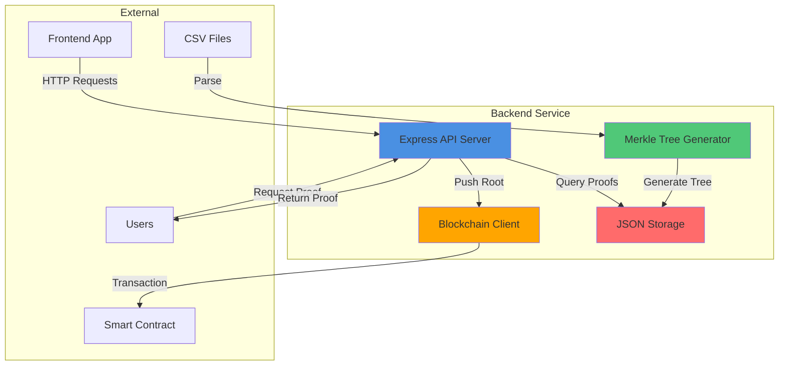
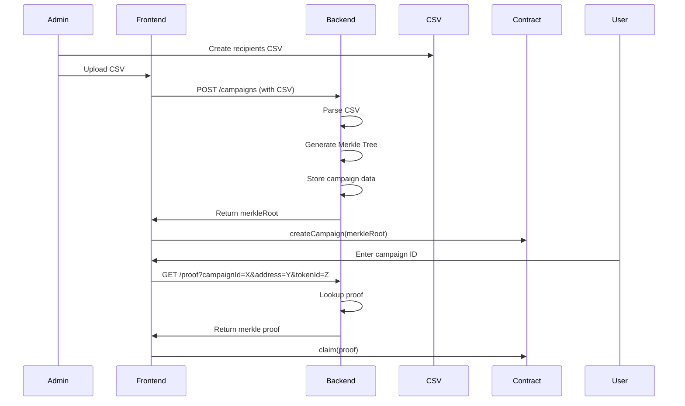
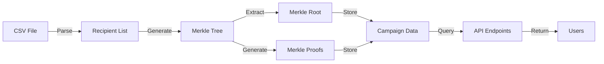
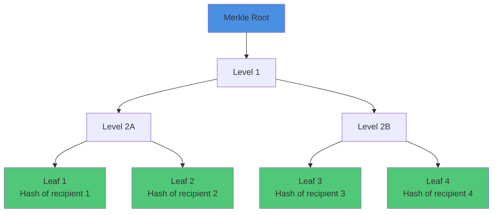

# Rootstock ERC-1155 Airdrop Backend

Node.js/Express backend service for the ERC-1155 airdrop system with Merkle tree generation, REST API, and Rootstock blockchain integration.

## 📋 Table of Contents

- [Overview](#overview)
- [Architecture](#architecture)
- [Features](#features)
- [Installation](#installation)
- [Configuration](#configuration)
- [API Reference](#api-reference)
- [Merkle Tree Generation](#merkle-tree-generation)
- [Usage](#usage)
- [Testing](#testing)
- [Deployment](#deployment)

## 🎯 Overview

The backend service provides essential off-chain functionality for the airdrop system:

- **Merkle Tree Generation**: Creates Merkle trees from recipient CSV/JSON files
- **Proof API**: Provides Merkle proofs for eligible users
- **Campaign Management**: Stores campaign metadata and tracks claims
- **Blockchain Integration**: Scripts to interact with deployed smart contracts
- **RUNES Verification**: Support for bridged RUNES token verification

## 🏗️ Architecture

### System Architecture



### Request Flow



### Data Flow



## ✨ Features

### Core Features

1. **Merkle Tree Generation**
   - Parse CSV/JSON recipient files
   - Generate Merkle trees with configurable campaign IDs
   - Export proofs for each recipient

2. **REST API**
   - Campaign management endpoints
   - Proof retrieval endpoints
   - Status and health check endpoints

3. **Blockchain Integration**
   - Push Merkle roots to smart contracts
   - Verify contract state
   - Transaction management

4. **RUNES Support**
   - Verify bridged RUNES tokens
   - Mock verification for testing

5. **Data Persistence**
   - JSON-based storage for campaigns
   - Claim tracking
   - Campaign metadata

## 🚀 Installation

### Prerequisites

- Node.js >= 18
- npm or yarn
- Access to Rootstock testnet/mainnet RPC

### Setup

1. **Navigate to backend directory**:
```bash
cd backend
```

2. **Install dependencies**:
```bash
npm install
```

3. **Copy environment file**:
```bash
cp .env.example .env
```

4. **Configure environment variables** (see [Configuration](#configuration))

5. **Build TypeScript**:
```bash
npm run build
```

6. **Start the server**:
```bash
npm start
```

For development with auto-reload:
```bash
npm run dev
```

## ⚙️ Configuration

### Environment Variables

Create a `.env` file in the backend directory:

```env
# Server Configuration
PORT=3000
API_KEY=your-secret-api-key-here-change-this

# Rootstock RPC
RPC_URL=https://public-node.testnet.rsk.co
PRIVATE_KEY=your-private-key-without-0x-prefix

# Contract Addresses
AIRDROP_ENGINE_ADDRESS=0xe73ed2770E308cA94CB2Ad2E828af3832c19bfb2
AIRDROP_TOKEN_ADDRESS=0x50eDe9B383248648d446646BE0aB44927279d766

# RUNES Bridge (Optional)
BRIDGE_API_KEY=your-bridge-api-key-here
BRIDGE_API_URL=https://api.rootstock.io/bridge/v1
USE_MOCK_RUNES_VERIFICATION=true
```

### Configuration Details

- **PORT**: Server port (default: 3000)
- **API_KEY**: Secret key for API authentication
- **RPC_URL**: Rootstock RPC endpoint
- **PRIVATE_KEY**: Private key for contract interactions (without 0x prefix)
- **AIRDROP_ENGINE_ADDRESS**: Deployed AirdropEngine contract address
- **AIRDROP_TOKEN_ADDRESS**: Deployed AirdropToken contract address
- **USE_MOCK_RUNES_VERIFICATION**: Use mock RUNES verification (true for testing)

## 📡 API Reference

### Base URL

```
http://localhost:3000/api
```

### Authentication

All endpoints require the `X-API-Key` header:

```
X-API-Key: your-secret-api-key-here
```

### Endpoints

#### 1. Create Campaign

**POST** `/campaigns`

Create a new campaign with recipients.

**Request Body**:
```json
{
  "name": "My Campaign",
  "tokenContract": "0x50eDe9B383248648d446646BE0aB44927279d766",
  "tokenIds": [1, 2],
  "recipients": [
    {
      "address": "0x1111...",
      "tokenId": 1,
      "amount": 1000
    }
  ]
}
```

**Response**:
```json
{
  "campaignId": 0,
  "merkleRoot": "0xf1f143a9cd214014a785fdde0c5061743f403e16a9115f33468537236d5afdc5",
  "totalRecipients": 1
}
```

#### 2. Get Campaign

**GET** `/campaigns/:campaignId`

Get campaign details.

**Response**:
```json
{
  "campaignId": 0,
  "name": "My Campaign",
  "tokenContract": "0x50eDe9B383248648d446646BE0aB44927279d766",
  "tokenIds": [1, 2],
  "merkleRoot": "0xf1f143a9cd214014a785fdde0c5061743f403e16a9115f33468537236d5afdc5",
  "totalRecipients": 1,
  "totalClaimed": 0
}
```

#### 3. Get Proof

**GET** `/proof`

Get Merkle proof for a user.

**Query Parameters**:
- `campaignId` (required): Campaign ID
- `address` (required): User wallet address
- `tokenId` (required): Token ID

**Example**:
```
GET /api/proof?campaignId=0&address=0x1111...&tokenId=1
```

**Response**:
```json
{
  "proof": [
    "0x1234...",
    "0x5678..."
  ],
  "tokenId": "1",
  "amount": "1000",
  "leaf": "0xabcd..."
}
```

**Error Response** (404):
```json
{
  "error": "Proof not found for this address"
}
```

#### 4. List Campaigns

**GET** `/campaigns`

Get all campaigns.

**Response**:
```json
[
  {
    "campaignId": 0,
    "name": "My Campaign",
    "totalRecipients": 1
  }
]
```

#### 5. Health Check

**GET** `/health`

Check server health.

**Response**:
```json
{
  "status": "ok",
  "timestamp": "2024-01-01T00:00:00.000Z"
}
```

## 🌳 Merkle Tree Generation

### CSV Format

Create a CSV file with recipients:

```csv
address,tokenId,amount
0x1111111111111111111111111111111111111111,1,1000
0x2222222222222222222222222222222222222222,1,2000
0x3333333333333333333333333333333333333333,2,1500
```

### Generate Merkle Tree

#### Using Script

```bash
npm run generate-merkle -- --input test-recipients.csv --campaign-id 0
```

#### Using API

```bash
curl -X POST http://localhost:3000/api/campaigns \
  -H "Content-Type: application/json" \
  -H "X-API-Key: your-api-key" \
  -d '{
    "name": "My Campaign",
    "tokenContract": "0x50eDe9B383248648d446646BE0aB44927279d766",
    "tokenIds": [1],
    "recipients": [
      {"address": "0x1111...", "tokenId": 1, "amount": 1000}
    ]
  }'
```

### Merkle Tree Structure



### Leaf Hash Calculation

The leaf hash is calculated as:

```
keccak256(abi.encodePacked(campaignId, address, tokenId, amount))
```

This matches the contract's verification logic.

## 📖 Usage

### Starting the Server

```bash
# Development mode (with auto-reload)
npm run dev

# Production mode
npm run build
npm start
```

### Generate Merkle Tree from CSV

```bash
npm run generate-merkle -- \
  --input test-recipients.csv \
  --campaign-id 0 \
  --output merkle-output.json
```

### Push Merkle Root to Contract

```bash
npm run push-root -- \
  --campaign-id 0 \
  --merkle-root 0xf1f143a9cd214014a785fdde0c5061743f403e16a9115f33468537236d5afdc5
```

### Example: Complete Workflow

1. **Create CSV file** with recipients
2. **Generate Merkle tree**:
   ```bash
   npm run generate-merkle -- --input recipients.csv --campaign-id 0
   ```
3. **Get Merkle root** from output
4. **Create campaign on-chain** (via frontend or script)
5. **Start backend server**:
   ```bash
   npm run dev
   ```
6. **Users request proofs** via API
7. **Users claim tokens** using proofs

## 🧪 Testing

### Run Tests

```bash
npm test
```

### Run Tests in Watch Mode

```bash
npm run test:watch
```

### Run Tests with Coverage

```bash
npm run test:coverage
```

### Test Structure

- Unit tests for Merkle tree generation
- API endpoint tests
- Integration tests with mock contracts

## 🚢 Deployment

### Production Deployment

1. **Set environment variables**:
   - Use production RPC URL
   - Use production contract addresses
   - Set secure API key
   - Configure CORS for frontend domain

2. **Build the project**:
   ```bash
   npm run build
   ```

3. **Start the server**:
   ```bash
   npm start
   ```

### Using PM2

```bash
npm install -g pm2
pm2 start dist/index.js --name airdrop-backend
pm2 save
pm2 startup
```

### Docker (Optional)

Create a `Dockerfile`:

```dockerfile
FROM node:18-alpine
WORKDIR /app
COPY package*.json ./
RUN npm ci --only=production
COPY . .
RUN npm run build
EXPOSE 3000
CMD ["npm", "start"]
```

Build and run:
```bash
docker build -t airdrop-backend .
docker run -p 3000:3000 --env-file .env airdrop-backend
```

## 📁 Project Structure

```
backend/
├── src/
│   ├── index.ts              # Express server setup
│   ├── routes/
│   │   ├── campaigns.ts      # Campaign routes
│   │   ├── proof.ts          # Proof routes
│   │   └── health.ts         # Health check
│   ├── services/
│   │   ├── merkle.ts         # Merkle tree generation
│   │   └── storage.ts        # JSON storage
│   └── utils/
│       └── contract.ts       # Contract interaction
├── scripts/
│   ├── generate-merkle.ts    # CLI Merkle generator
│   └── push-root.ts          # Push root to contract
├── data/
│   └── campaigns.json        # Campaign storage
├── tests/
│   └── *.test.ts             # Test files
├── package.json
├── tsconfig.json
└── README.md
```

## 🔒 Security

### Best Practices

1. **API Key Security**: Use strong, random API keys
2. **Private Key Security**: Never commit private keys
3. **CORS Configuration**: Restrict to frontend domain
4. **Input Validation**: Validate all inputs
5. **Rate Limiting**: Consider adding rate limiting for production

### Environment Variables

- Never commit `.env` files
- Use different keys for testnet/mainnet
- Rotate keys regularly

## 🔗 Integration

### With Frontend

The frontend calls the backend API for:
- Campaign creation
- Proof retrieval
- Campaign status

### With Smart Contracts

The backend can:
- Push Merkle roots to contracts
- Verify contract state
- Monitor transactions

## 📝 License

MIT

## 🤝 Contributing

1. Fork the repository
2. Create a feature branch
3. Make your changes
4. Add tests
5. Submit a pull request

## 📞 Support

For issues and questions:
- Check the main README.md
- Review API documentation
- Open an issue on GitHub

