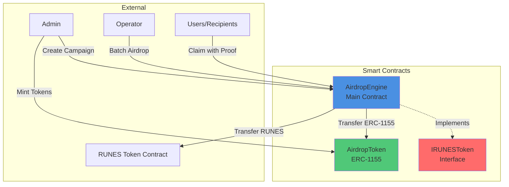
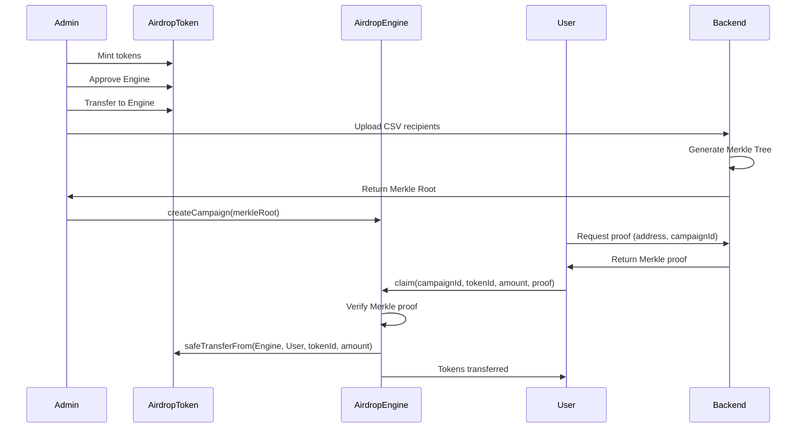
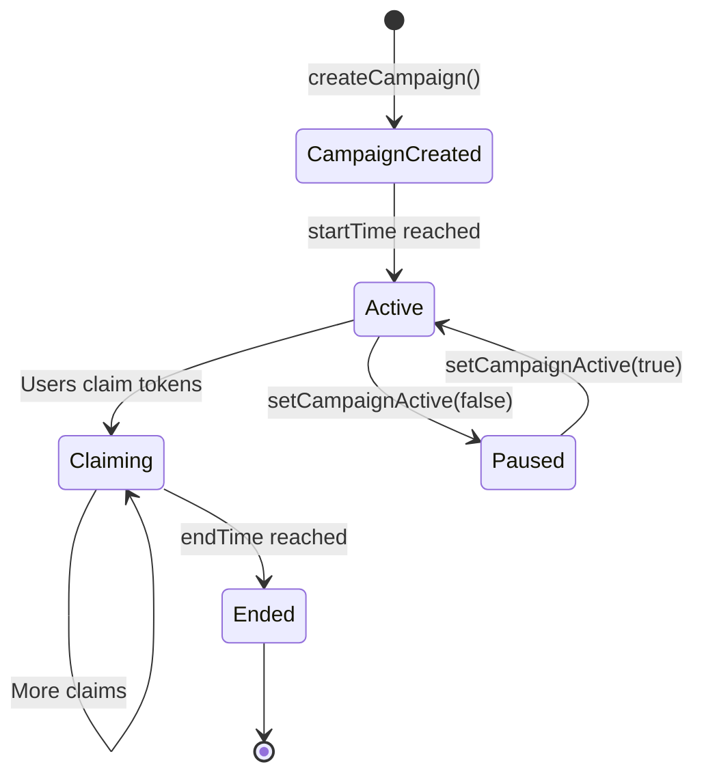

# Rootstock ERC-1155 Airdrop Engine - Smart Contracts

A comprehensive Foundry-based smart contract system for Rootstock that implements an ERC-1155 airdrop engine with Merkle-proof claims, batch distribution, and RUNES token support.

## 📋 Table of Contents

- [Overview](#overview)
- [Architecture](#architecture)
- [Features](#features)
- [Project Structure](#project-structure)
- [Installation](#installation)
- [Deployment](#deployment)
- [Usage](#usage)
- [Testing](#testing)
- [Security](#security)
- [Gas Optimization](#gas-optimization)

## 🎯 Overview

The Airdrop Engine is a gas-efficient, secure smart contract system designed for distributing ERC-1155 tokens and bridged RUNES tokens on Rootstock. It uses Merkle proofs for eligibility verification, enabling scalable airdrops without requiring on-chain storage of recipient lists.

### Key Capabilities

- **Multi-Token Support**: ERC-1155 tokens and bridged RUNES tokens
- **Merkle Proof Verification**: Off-chain eligibility, on-chain verification
- **Batch Operations**: Efficient batch distribution for operators
- **Campaign Management**: Multiple concurrent campaigns with flexible parameters
- **Access Control**: Role-based permissions (Admin, Operator)

## 🏗️ Architecture

### System Architecture



### Contract Interaction Flow



### Campaign Lifecycle



## ✨ Features

### 1. ERC-1155 Token Contract (`AirdropToken.sol`)

- **Standard ERC-1155 Implementation**: Full OpenZeppelin ERC1155 support
- **Minting Capabilities**: Single and batch minting
- **URI Management**: Per-token metadata via `uri()` function
- **Access Control**: Admin-controlled minting

### 2. Airdrop Engine (`AirdropEngine.sol`)

- **Campaign Management**: Create, activate/deactivate campaigns
- **Merkle Proof Claims**: Secure eligibility verification
- **Batch Distribution**: Admin-controlled batch airdrops
- **RUNES Support**: Integration with bridged RUNES tokens
- **Claim Tracking**: Prevent double-claiming via leaf hash mapping

### 3. Access Control

- **DEFAULT_ADMIN_ROLE**: Full control, can grant/revoke roles
- **ADMIN_ROLE**: Can create campaigns, manage status
- **OPERATOR_ROLE**: Can execute batch airdrops

## 📁 Project Structure

```
contracts/
├── src/
│   ├── AirdropToken.sol          # ERC-1155 token contract
│   ├── AirdropEngine.sol          # Main airdrop engine
│   ├── interfaces/
│   │   └── IRUNESToken.sol        # RUNES token interface
│   └── mocks/
│       └── MockRUNESToken.sol     # Mock for testing
├── test/
│   ├── AirdropEngine.t.sol        # Engine tests
│   └── AirdropToken.t.sol         # Token tests
├── script/
│   └── Deploy.s.sol               # Deployment script
├── foundry.toml                   # Foundry configuration
└── README.md                      # This file
```

## 🚀 Installation

### Prerequisites

- [Foundry](https://book.getfoundry.sh/getting-started/installation) (forge, cast, anvil)
- Solidity ^0.8.24
- Git

### Setup

1. **Install Foundry** (if not already installed):
```bash
curl -L https://foundry.paradigm.xyz | bash
foundryup
```

2. **Navigate to contracts directory**:
```bash
cd contracts
```

3. **Install dependencies**:
```bash
forge install OpenZeppelin/openzeppelin-contracts --no-commit
```

4. **Verify installation**:
```bash
forge --version
```

## 🚢 Deployment

### Configuration

Update `foundry.toml` with your settings:

```toml
[rpc_endpoints]
rootstock_testnet = "https://public-node.testnet.rsk.co"
rootstock_mainnet = "https://public-node.rsk.co"
```

### Deploy to Rootstock Testnet

1. **Set your private key** (without 0x prefix):
```bash
export PRIVATE_KEY=your_private_key_here
```

2. **Deploy contracts**:
```bash
forge script script/Deploy.s.sol \
  --rpc-url rootstock_testnet \
  --broadcast \
  --verify \
  --private-key $PRIVATE_KEY
```

3. **Save contract addresses**:
After deployment, save the addresses:
- `AirdropToken` address
- `AirdropEngine` address

### Deploy to Rootstock Mainnet

```bash
forge script script/Deploy.s.sol \
  --rpc-url rootstock_mainnet \
  --broadcast \
  --verify \
  --private-key $PRIVATE_KEY
```

## 📖 Usage

### 1. Deploy Contracts

```solidity
// Deploy AirdropToken
AirdropToken token = new AirdropToken(baseURI, admin);

// Deploy AirdropEngine
AirdropEngine engine = new AirdropEngine(admin);
```

### 2. Create a Campaign

```solidity
uint256[] memory tokenIds = new uint256[](2);
tokenIds[0] = 1;
tokenIds[1] = 2;

bytes32 merkleRoot = 0xf1f143a9cd214014a785fdde0c5061743f403e16a9115f33468537236d5afdc5;
string memory metadata = '{"name": "My Campaign", "description": "..."}';
uint256 startTime = block.timestamp;
uint256 endTime = block.timestamp + 30 days;

uint256 campaignId = engine.createCampaign(
    address(token),
    false, // isRunesToken
    tokenIds,
    merkleRoot,
    metadata,
    startTime,
    endTime
);
```

### 3. Deposit Tokens

Before users can claim, deposit tokens to the AirdropEngine contract:

```solidity
// Mint tokens to yourself
token.mint(admin, tokenId, amount, "");

// Approve engine to transfer
token.setApprovalForAll(address(engine), true);

// Transfer tokens to engine
token.safeTransferFrom(admin, address(engine), tokenId, amount, "");
```

### 4. User Claims Tokens

```solidity
bytes32[] memory merkleProof = [...]; // From backend API

engine.claim(
    campaignId,
    tokenId,
    amount,
    merkleProof
);
```

### 5. Batch Airdrop (Alternative)

```solidity
address[] memory recipients = new address[](3);
recipients[0] = 0x1111...;
recipients[1] = 0x2222...;
recipients[2] = 0x3333...;

uint256[] memory tokenIds = new uint256[](3);
tokenIds[0] = 1;
tokenIds[1] = 1;
tokenIds[2] = 2;

uint256[] memory amounts = new uint256[](3);
amounts[0] = 100;
amounts[1] = 200;
amounts[2] = 150;

engine.batchAirdrop(campaignId, recipients, tokenIds, amounts);
```

## 🧪 Testing

### Run All Tests

```bash
forge test
```

### Run with Verbose Output

```bash
forge test -vvv
```

### Run Specific Test

```bash
forge test --match-contract AirdropEngine
```

### Test Coverage

```bash
forge coverage
```

### Test Structure

- **AirdropEngine.t.sol**: Tests campaign creation, claims, batch operations, access control
- **AirdropToken.t.sol**: Tests minting, transfers, URI management

## 🔒 Security

### Security Features

1. **Access Control**: OpenZeppelin AccessControl for role management
2. **Merkle Proof Verification**: Cryptographic proof of eligibility
3. **Double-Claim Prevention**: Leaf hash tracking prevents duplicate claims
4. **Reentrancy Protection**: Safe transfer patterns
5. **Input Validation**: Comprehensive require statements

### Audit Checklist

- ✅ Access control implemented
- ✅ Merkle proof verification
- ✅ Double-claim prevention
- ✅ Safe transfer patterns
- ✅ Input validation
- ✅ Time-based campaign controls

### Best Practices

1. **Always verify Merkle roots** before creating campaigns
2. **Test thoroughly** on testnet before mainnet deployment
3. **Use time locks** for critical operations in production
4. **Monitor campaign status** regularly
5. **Keep admin keys secure** and use multisig for production

## ⛽ Gas Optimization

### Optimizations Implemented

1. **Packed Storage**: Campaign struct uses efficient types
2. **Batch Operations**: Single transaction for multiple transfers
3. **Merkle Proofs**: Off-chain eligibility, minimal on-chain verification
4. **Unchecked Arithmetic**: Safe unchecked blocks where applicable

### Gas Costs (Approximate)

- `createCampaign`: ~150,000 gas
- `claim`: ~80,000 - 120,000 gas (depends on proof length)
- `batchAirdrop`: ~50,000 + (30,000 × recipients) gas

## 📚 Contract Reference

### AirdropEngine Functions

#### Campaign Management

- `createCampaign(...)`: Create a new airdrop campaign
- `setCampaignActive(uint256 campaignId, bool active)`: Enable/disable campaign
- `getCampaign(uint256 campaignId)`: Get campaign details

#### Claims

- `claim(uint256 campaignId, uint256 tokenId, uint256 amount, bytes32[] calldata merkleProof)`: Claim tokens
- `isClaimed(uint256 campaignId, bytes32 leafHash)`: Check if already claimed

#### Batch Operations

- `batchAirdrop(uint256 campaignId, address[] recipients, uint256[] tokenIds, uint256[] amounts)`: Batch distribute tokens

### AirdropToken Functions

- `mint(address to, uint256 id, uint256 amount, bytes data)`: Mint tokens
- `mintBatch(address to, uint256[] ids, uint256[] amounts, bytes data)`: Batch mint
- `setURI(string memory newuri)`: Update base URI

## 🔗 Integration

### With Backend

The backend generates Merkle trees and provides proofs. The contract verifies proofs on-chain.

### With Frontend

The frontend uses wagmi/viem to interact with contracts. See frontend README for details.

## 📝 License

MIT

## 🤝 Contributing

1. Fork the repository
2. Create a feature branch
3. Make your changes
4. Add tests
5. Submit a pull request

## 📞 Support

For issues and questions:
- Check the main README.md
- Review test files for usage examples
- Open an issue on GitHub

