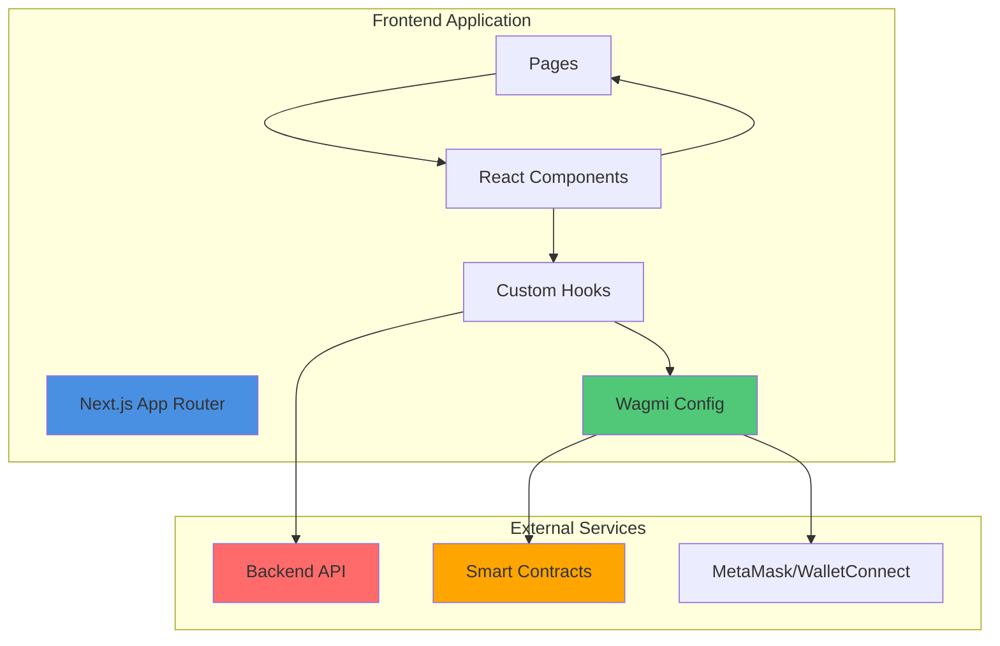
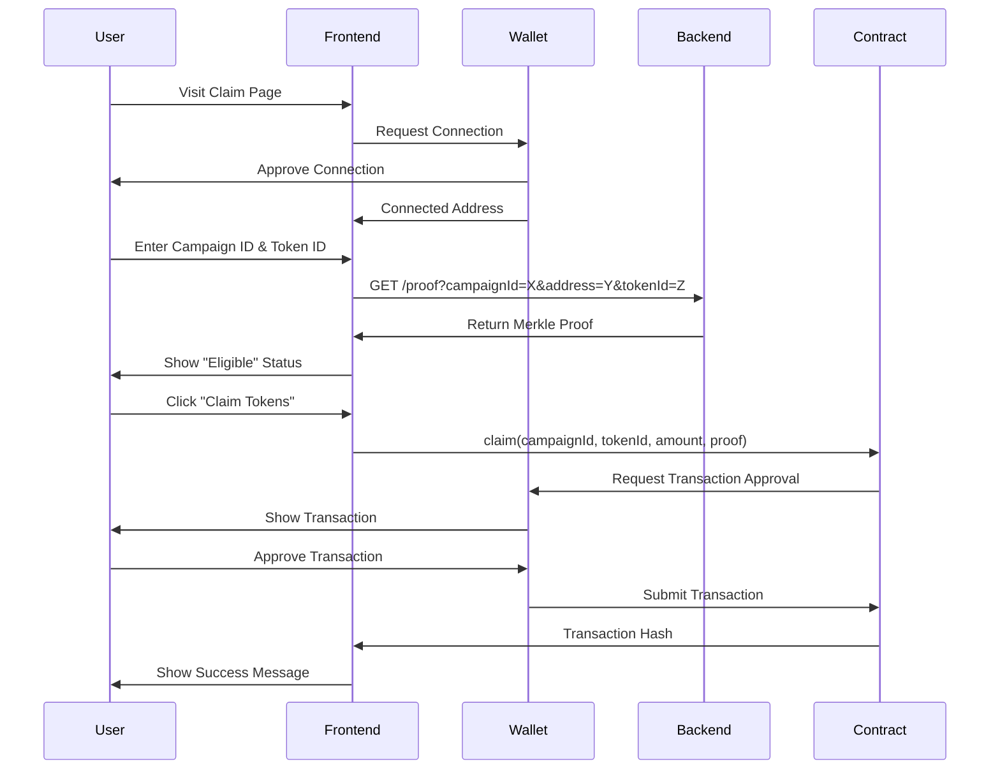
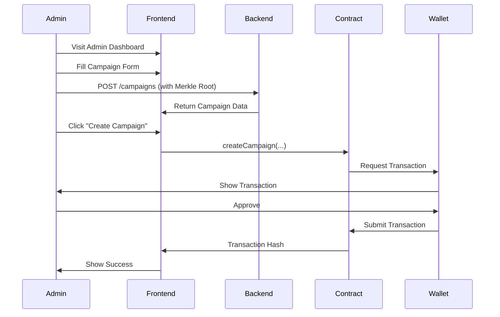
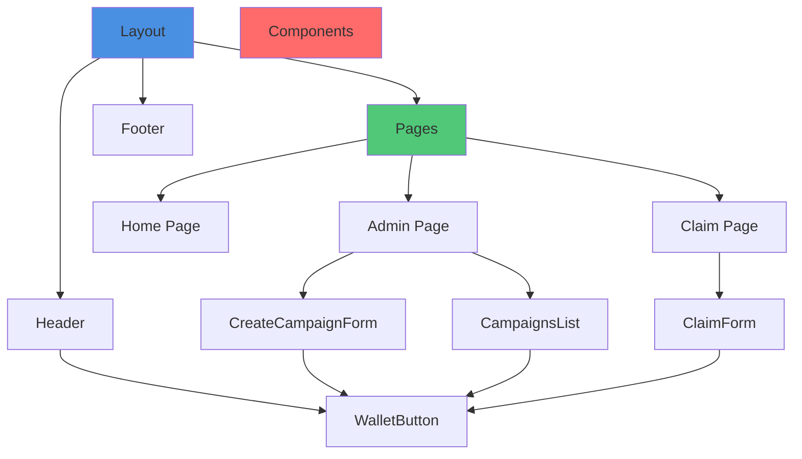

# Rootstock ERC-1155 Airdrop Frontend

Modern Next.js frontend application for the ERC-1155 airdrop system with admin dashboard, user claim interface, and seamless wallet integration.

## 📋 Table of Contents

- [Overview](#overview)
- [Architecture](#architecture)
- [Features](#features)
- [Installation](#installation)
- [Configuration](#configuration)
- [Project Structure](#project-structure)
- [Usage](#usage)
- [Components](#components)
- [Styling](#styling)
- [Building](#building)
- [Troubleshooting](#troubleshooting)

## 🎯 Overview

The frontend provides a beautiful, responsive user interface for both administrators and end users:

- **Admin Dashboard**: Create campaigns, manage airdrops, view statistics
- **User Claim Interface**: Connect wallet, check eligibility, claim tokens
- **Wallet Integration**: Seamless MetaMask and WalletConnect support
- **Real-time Updates**: Live campaign status and claim tracking
- **Rootstock Design**: Beautiful UI matching Rootstock.io aesthetics

## 🏗️ Architecture

### Application Architecture



### User Flow



### Admin Flow



### Component Hierarchy



## ✨ Features

### Core Features

1. **Admin Dashboard**
   - Create new airdrop campaigns
   - View all active campaigns
   - Monitor campaign statistics
   - Push Merkle roots to blockchain

2. **User Claim Interface**
   - Connect wallet (MetaMask/WalletConnect)
   - Check eligibility for campaigns
   - Claim tokens with one click
   - View transaction status

3. **Wallet Integration**
   - MetaMask support
   - WalletConnect support
   - Automatic network detection
   - Transaction status tracking

4. **Design System**
   - Rootstock.io-inspired design
   - Responsive layout
   - Modern gradients and animations
   - Accessible UI components

## 🚀 Installation

### Prerequisites

- Node.js >= 18
- npm or yarn
- Backend server running (see backend README)
- Deployed smart contracts

### Setup

1. **Navigate to frontend directory**:
```bash
cd frontend
```

2. **Install dependencies**:
```bash
npm install
```

3. **Copy environment file**:
```bash
cp .env.local.example .env.local
```

4. **Configure environment variables** (see [Configuration](#configuration))

5. **Start development server**:
```bash
npm run dev
```

6. **Open browser**:
```
http://localhost:3001
```

## ⚙️ Configuration

### Environment Variables

Create a `.env.local` file in the frontend directory:

```env
# Rootstock Network
NEXT_PUBLIC_RPC_URL=https://public-node.testnet.rsk.co
NEXT_PUBLIC_CHAIN_ID=31

# Backend API
NEXT_PUBLIC_API_URL=http://localhost:3000
NEXT_PUBLIC_API_KEY=your-secret-api-key-here

# Contract Addresses
NEXT_PUBLIC_AIRDROP_ENGINE_ADDRESS=0xe73ed2770E308cA94CB2Ad2E828af3832c19bfb2
NEXT_PUBLIC_AIRDROP_TOKEN_ADDRESS=0x50eDe9B383248648d446646BE0aB44927279d766

# WalletConnect (Optional)
NEXT_PUBLIC_WALLETCONNECT_PROJECT_ID=your-walletconnect-project-id
```

### Configuration Details

- **NEXT_PUBLIC_RPC_URL**: Rootstock RPC endpoint
- **NEXT_PUBLIC_CHAIN_ID**: Rootstock chain ID (31 for testnet, 30 for mainnet)
- **NEXT_PUBLIC_API_URL**: Backend API URL
- **NEXT_PUBLIC_API_KEY**: API key for backend authentication
- **NEXT_PUBLIC_AIRDROP_ENGINE_ADDRESS**: Deployed AirdropEngine contract
- **NEXT_PUBLIC_AIRDROP_TOKEN_ADDRESS**: Deployed AirdropToken contract
- **NEXT_PUBLIC_WALLETCONNECT_PROJECT_ID**: WalletConnect project ID (optional)

## 📁 Project Structure

```
frontend/
├── app/
│   ├── layout.tsx              # Root layout with providers
│   ├── page.tsx                # Home page
│   ├── globals.css             # Global styles
│   ├── admin/
│   │   └── page.tsx            # Admin dashboard
│   └── claim/
│       └── page.tsx            # User claim page
├── components/
│   ├── Header.tsx              # Global header/navigation
│   ├── Footer.tsx              # Global footer
│   ├── WalletButton.tsx        # Wallet connection button
│   ├── CreateCampaignForm.tsx  # Campaign creation form
│   ├── CampaignsList.tsx       # Campaign list display
│   └── ClaimForm.tsx           # Token claim form
├── hooks/
│   ├── useAirdropEngine.ts     # AirdropEngine contract hooks
│   ├── useAirdropToken.ts      # AirdropToken contract hooks
│   └── useBackendAPI.ts        # Backend API hooks
├── contracts/
│   ├── abis/                   # Contract ABIs
│   │   ├── AirdropEngine.json
│   │   └── AirdropToken.json
│   └── addresses.ts            # Contract addresses
├── lib/
│   └── wagmi.ts                # Wagmi configuration
├── tailwind.config.ts          # Tailwind CSS config
├── next.config.js              # Next.js config
├── package.json
└── README.md
```

## 📖 Usage

### Development

Start the development server:

```bash
npm run dev
```

The app will be available at `http://localhost:3001`

### Admin Dashboard

1. Navigate to `/admin`
2. Connect your wallet (must have admin role)
3. Create a campaign:
   - Fill in campaign details
   - Enter Merkle root (generated by backend)
   - Set start/end times
   - Click "Create Campaign"
4. View campaigns:
   - See all active campaigns
   - View statistics (recipients, claimed, unclaimed)
   - Push Merkle roots to chain

### User Claim

1. Navigate to `/claim`
2. Connect your wallet
3. Enter Campaign ID and Token ID
4. System automatically:
   - Fetches proof from backend
   - Checks eligibility
   - Shows claim button if eligible
5. Click "Claim Tokens"
6. Approve transaction in wallet
7. View success message and transaction link

## 🧩 Components

### Header Component

Global navigation header with:
- Logo and branding
- Navigation links (Home, Admin, Claim)
- Wallet connection button

### Footer Component

Global footer with:
- Project information
- Links to resources
- Copyright information

### WalletButton Component

Handles wallet connection:
- MetaMask detection
- WalletConnect support
- Network switching
- Connection status display

### CreateCampaignForm Component

Admin form for creating campaigns:
- Campaign name input
- Token contract address
- Token IDs input
- Merkle root input
- Start/end time pickers
- Transaction status display

### CampaignsList Component

Displays all campaigns:
- Campaign cards with details
- Status indicators
- Statistics display
- Action buttons

### ClaimForm Component

User interface for claiming tokens:
- Campaign ID input
- Token ID input
- Eligibility check
- Proof fetching
- Claim button
- Transaction status

## 🎨 Styling

### Design System

The frontend uses a Rootstock-inspired design system:

- **Colors**: Blue gradients matching Rootstock.io
- **Typography**: Inter font family
- **Components**: Rounded corners, shadows, gradients
- **Animations**: Smooth transitions and hover effects
- **Responsive**: Mobile-first design

### Tailwind CSS

Custom Tailwind configuration includes:
- Primary color palette
- Custom font families
- Extended spacing
- Custom utilities

### Global Styles

- Google Fonts (Inter)
- Background patterns
- Smooth scrolling
- Custom CSS variables

## 🏗️ Building

### Build for Production

```bash
npm run build
```

### Start Production Server

```bash
npm start
```

### Build Output

The build creates an optimized production bundle in the `.next` directory.

## 🔗 Integration

### With Backend

The frontend communicates with the backend API for:
- Campaign creation
- Proof retrieval
- Campaign status

### With Smart Contracts

The frontend uses wagmi/viem to:
- Read contract state
- Write transactions
- Listen to events
- Track transaction status

### With Wallets

The frontend supports:
- MetaMask (browser extension)
- WalletConnect (mobile wallets)
- Injected wallets

## 🧪 Testing

### Run Linter

```bash
npm run lint
```

### Type Checking

TypeScript will check types during build.

## 🐛 Troubleshooting

### Wallet Connection Issues

**Problem**: Wallet not connecting

**Solutions**:
- Ensure MetaMask is installed
- Check you're on Rootstock network
- Verify RPC URL is correct
- Try refreshing the page

### Contract Interaction Errors

**Problem**: Transactions failing

**Solutions**:
- Verify contract addresses in `.env.local`
- Check ABIs are in `contracts/abis/`
- Ensure wallet is connected
- Verify you have admin role (for admin actions)

### API Errors

**Problem**: Backend API not responding

**Solutions**:
- Verify backend is running
- Check `NEXT_PUBLIC_API_URL` is correct
- Verify API key matches backend
- Check CORS settings on backend

### Build Errors

**Problem**: Build failing

**Solutions**:
- Clear `.next` directory: `rm -rf .next`
- Reinstall dependencies: `rm -rf node_modules && npm install`
- Check Node.js version (>= 18)
- Verify all environment variables are set

### Hydration Errors

**Problem**: React hydration mismatch

**Solutions**:
- Ensure `WalletButton` uses `mounted` state
- Check for server/client rendering differences
- Verify no direct DOM manipulation

## 📱 Responsive Design

The frontend is fully responsive:
- **Mobile**: Optimized for phones (320px+)
- **Tablet**: Optimized for tablets (768px+)
- **Desktop**: Full experience (1024px+)

## 🔒 Security

### Best Practices

1. **Environment Variables**: Never commit `.env.local`
2. **API Keys**: Use secure API keys
3. **Contract Addresses**: Verify addresses before use
4. **Wallet Security**: Users control their own wallets

## 📝 License

MIT

## 🤝 Contributing

1. Fork the repository
2. Create a feature branch
3. Make your changes
4. Test thoroughly
5. Submit a pull request

## 📞 Support

For issues and questions:
- Check the main README.md
- Review component documentation
- Open an issue on GitHub

